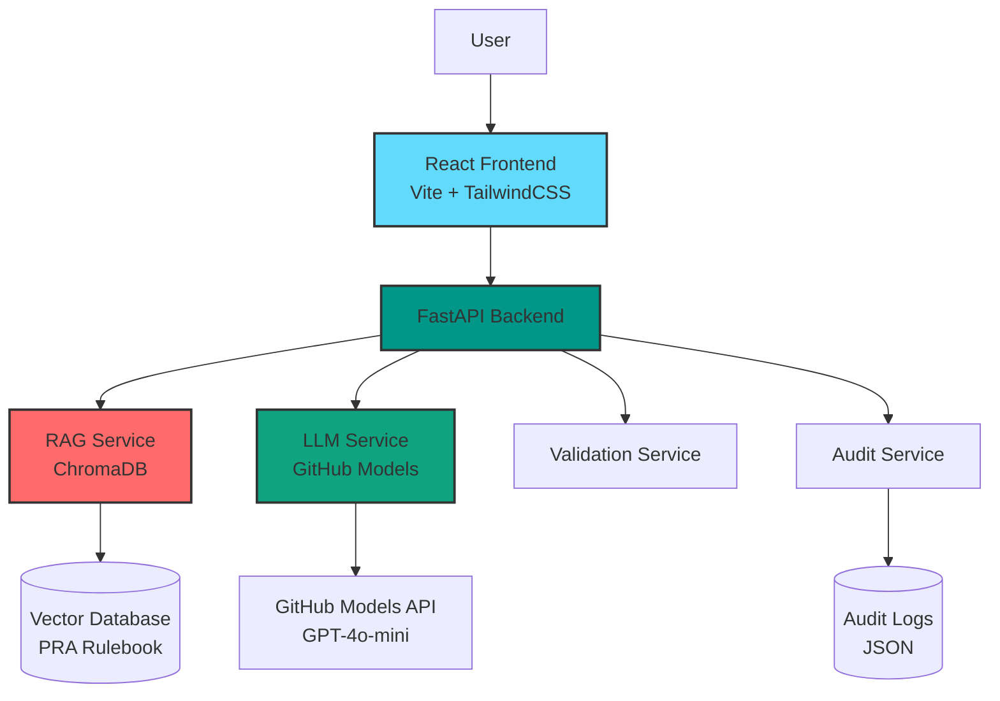

# PRA COREP Assistant 🚀

[](https://www.python.org/downloads/)
[](https://reactjs.org/)
[](https://fastapi.tiangolo.com/)
[](LICENSE)

> **LLM-assisted regulatory reporting assistant for PRA COREP templates**

Transform complex regulatory reporting from a manual, error-prone process into an automated, transparent, and auditable workflow using cutting-edge LLM technology.

---

## ✨ Key Features

### 🎯 Core Capabilities
- **Natural Language Queries**: Ask questions in plain English about COREP reporting
- **RAG-Based Retrieval**: Semantic search over PRA Rulebook using ChromaDB
- **GitHub Models Integration**: Powered by GPT-4o-mini with function calling
- **Automated Validation**: Multi-level checks for consistency and compliance
- **Complete Audit Trail**: Every value traced back to regulatory sources

### 🚀 Advanced Features
- **⚡ Streaming Responses**: Real-time progress updates with Server-Sent Events
- **🧠 Chain-of-Thought Reasoning**: Transparent step-by-step LLM reasoning
- **✅ Comprehensive Testing**: 30+ test cases with 70%+ coverage
- **📊 Confidence Scoring**: AI confidence levels for each populated field
- **🎨 Modern UI**: Dark theme with premium aesthetics and smooth animations

---

## 🏗️ Architecture



### Technology Stack

**Backend:**
- FastAPI (Python 3.9+)
- GitHub Models (GPT-4o-mini)
- ChromaDB (Vector database)
- Pydantic (Data validation)
- LangChain (RAG framework)

**Frontend:**
- React 18
- Vite (Build tool)
- TailwindCSS (Styling)
- Axios (HTTP client)

---

## 🚀 Quick Start

### Prerequisites
- Python 3.9+
- Node.js 18+
- GitHub Personal Access Token with `models:read` permission

### 1. Get GitHub Token

1. Go to [GitHub Settings → Tokens](https://github.com/settings/tokens)
2. Generate new token (classic)
3. Select `models:read` scope
4. Copy the token

### 2. Set Environment Variable

```powershell
# Windows PowerShell
$Env:GITHUB_TOKEN="your-github-token-here"
```

```bash
# Mac/Linux
export GITHUB_TOKEN="your-github-token-here"
```

### 3. Run Quick Start Script

```powershell
cd pra-corep-assistant
.\start.ps1
```

This will:
- Install all dependencies
- Start backend server (http://localhost:8000)
- Start frontend server (http://localhost:5173)

### 4. Access Application

Open your browser to **http://localhost:5173**

---

## 📖 Usage Example

### Step 1: Enter Query
```
"How should we report Tier 1 capital for our UK subsidiary?"
```

### Step 2: Provide Scenario
- Ordinary Shares: 500 (million GBP)
- Retained Earnings: 100 (million GBP)
- Additional Tier 1: 0
- Tier 2 Capital: 0

### Step 3: Watch Streaming Progress
- ⏳ Retrieving regulatory context...
- 🧠 Generating with chain-of-thought reasoning...
- ✅ Validating output...

### Step 4: Review Results

**Chain-of-Thought Reasoning:**
- 🔍 **Analysis**: Identified Articles 25, 51, 72
- 🧮 **Calculation**: 500M + 100M = 600M CET1
- 📋 **Justification**: Article 25 defines CET1 composition
- ✅ **Verification**: Tier 1 = CET1 + AT1 ✓

**Populated Template:**
- Total Own Funds: £600,000k (92% confidence)
- Tier 1 Capital: £600,000k (95% confidence)
- CET1: £600,000k (93% confidence)

**Validation:**
- ✅ All consistency checks passed
- ✅ All values positive
- ✅ Cross-field validation successful

**Audit Trail:**
- Complete rule citations
- LLM reasoning for each field
- Relevance scores for references

---

## 🧪 Testing

### Run Backend Tests

```bash
cd backend
pip install -r requirements-test.txt
pytest --cov=app tests/
```

### Test Coverage
- ✅ Validation Service: 9 test cases
- ✅ RAG Service: 8 test cases
- ✅ COREP Schemas: 7 test cases
- ✅ API Endpoints: 8 test cases
- **Total: 30+ test cases with 70%+ coverage**

---

## 📁 Project Structure

```
pra-corep-assistant/
├── backend/
│   ├── app/
│   │   ├── main.py                          # FastAPI app + streaming endpoint
│   │   ├── config.py                        # Configuration management
│   │   ├── models/                          # Pydantic models
│   │   ├── schemas/                         # COREP template schemas
│   │   └── services/
│   │       ├── rag_service.py               # RAG retrieval (ChromaDB)
│   │       ├── llm_service.py               # Standard LLM service
│   │       ├── llm_service_streaming.py     # Streaming LLM service
│   │       ├── validation_service.py        # Validation rules
│   │       └── audit_service.py             # Audit logging
│   ├── tests/                               # Comprehensive test suite
│   ├── data/                                # Data storage
│   └── requirements.txt                     # Python dependencies
├── frontend/
│   ├── src/
│   │   ├── App.jsx                          # Main app with streaming
│   │   ├── components/
│   │   │   ├── QueryForm.jsx                # Input form
│   │   │   ├── TemplateViewer.jsx           # COREP display
│   │   │   ├── ValidationPanel.jsx          # Validation results
│   │   │   ├── AuditLogViewer.jsx           # Audit trail
│   │   │   └── ReasoningViewer.jsx          # Chain-of-thought display
│   │   └── index.css                        # Global styles
│   └── package.json                         # Node dependencies
├── README.md                                # This file
├── SETUP.md                                 # Detailed setup guide
└── start.ps1                                # Quick start script
```

---

## 🎯 API Endpoints

### POST /api/query
Process COREP query (standard)

### POST /api/query/stream
Process COREP query with streaming (recommended)

### GET /api/templates
List available COREP templates

### GET /api/audit/{query_id}
Retrieve audit log

### GET /api/audit/{query_id}/report
Get human-readable audit report

### GET /api/health
Health check

---

## 🔬 Technical Highlights

### 1. Streaming Architecture
- Server-Sent Events (SSE) for real-time updates
- Progress tracking at each pipeline stage
- Partial results displayed as they arrive

### 2. Chain-of-Thought Prompting
```python
STEP 1 - ANALYZE: Identify applicable regulatory rules
STEP 2 - CALCULATE: Show step-by-step calculations
STEP 3 - JUSTIFY: Cite specific article paragraphs
STEP 4 - VERIFY: Check cross-field consistency
```

### 3. Hybrid RAG (Planned)
- Semantic search with ChromaDB
- BM25 keyword search
- Re-ranking with cross-encoder
- Query expansion

### 4. Validation Engine
- Type and range validation
- Cross-field consistency (Tier 1 = CET1 + AT1)
- Business rule enforcement
- Completeness checks

---

## 📚 Documentation

- **[SETUP.md](SETUP.md)**: Detailed installation and configuration
- **API Docs**: http://localhost:8000/docs (when running)

---

## 🚧 Future Enhancements

### Short-term
- [ ] Additional COREP templates (C 02.00, C 03.00)
- [ ] Export to Excel/PDF
- [ ] Enhanced error handling

### Medium-term
- [ ] Multi-agent system
- [ ] Fine-tuning on regulatory domain
- [ ] User authentication

### Long-term
- [ ] Production deployment
- [ ] Integration with bank systems
- [ ] Multi-language support

---

## 🤝 Contributing

This is a prototype for demonstration purposes. For production use, consider:
- Expanding the PRA Rulebook dataset
- Adding more COREP templates
- Implementing user authentication
- Setting up CI/CD pipeline
- Adding monitoring and logging

---

## 📄 License

MIT License - see LICENSE file for details

---

## 👤 Author

Vatsal Raina

---

## 🙏 Acknowledgments

- PRA Rulebook documentation
- GitHub Models for LLM access
- FastAPI and React communities
- ChromaDB for vector storage

